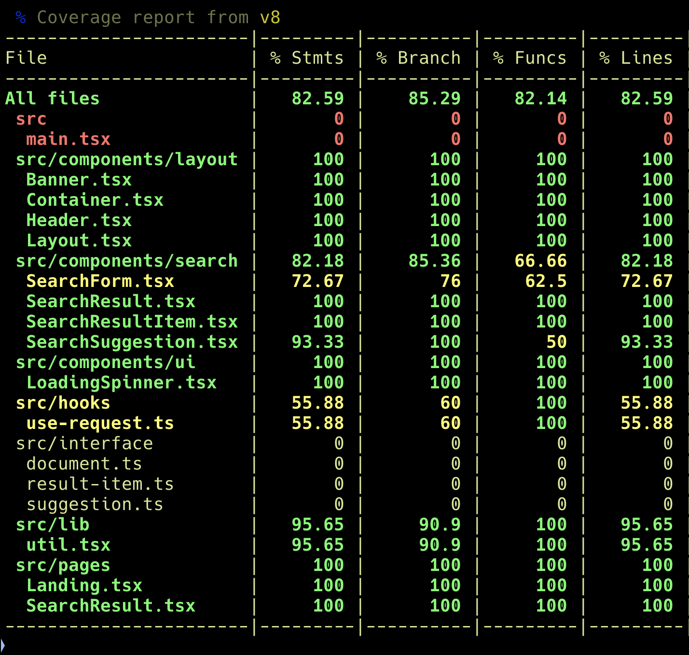
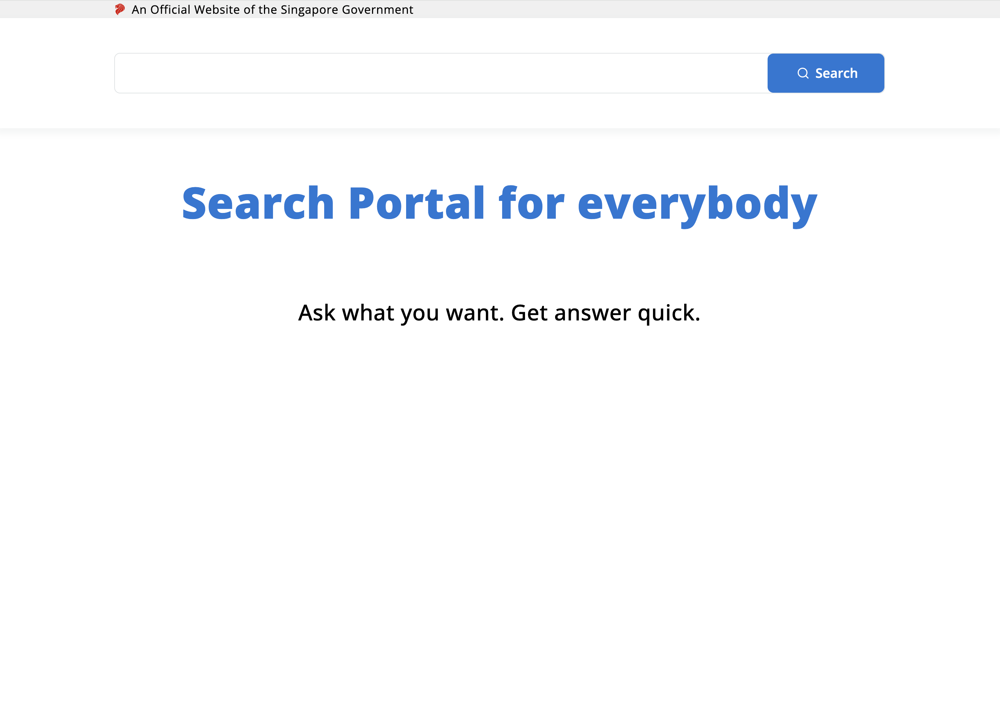
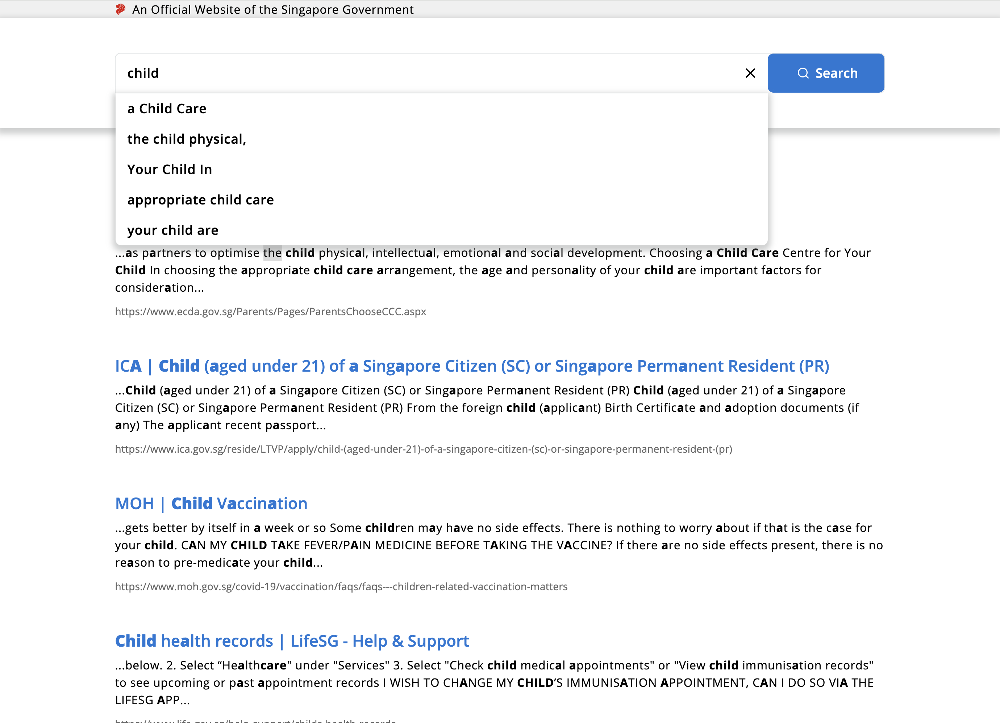
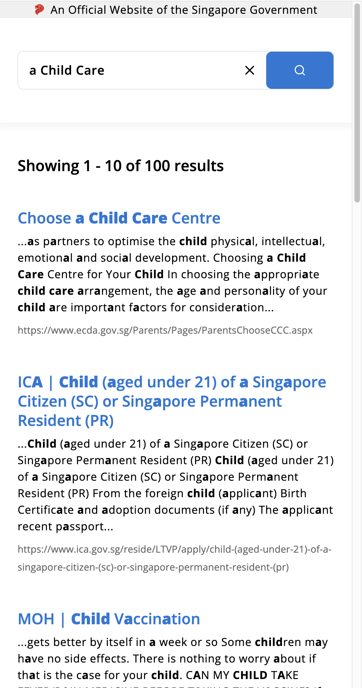
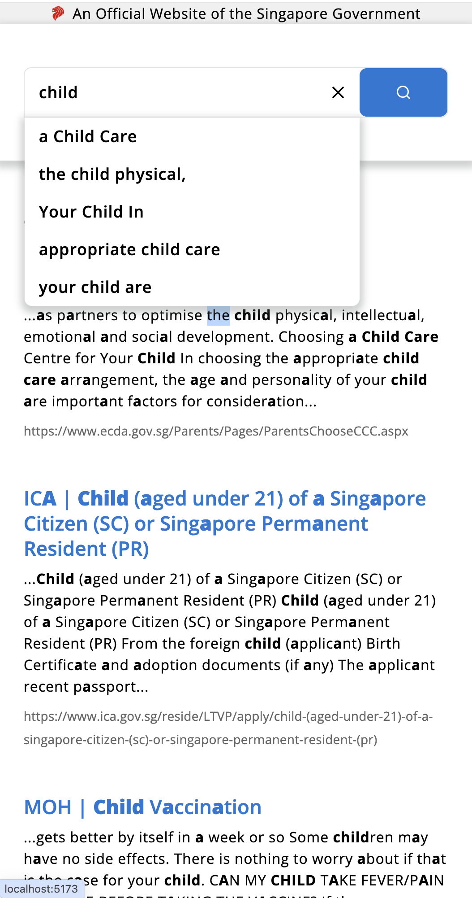

# GovTech DCube Developer Applicant Coding Challenge

This is a submission for the [GovTech DCube Developer Applicant Coding Challenge](https://gist.github.com/yuhong90/b5544baebde4bfe9fe2d12e8e5502cbf).

## 💻 Table of Contents

- 🔗 [Deployments]: (#deployments)
- 🗄️ [Project Structure](#project-structure)
- ⚙️ [Installation](#installation)
- 🚄 [Run the App](#run-the-app)
- 🧪 [Run Unit Tests]: (#run-unit-tests)
- 🧱 [Technologies Used](#technologies-used)
- 📷 [Preview]: (#preview)
- 📝 [Assumptions](#assumptions)

<h2 id="deployments">Deployments</h2>

### AWS
The project has a [github workflow](.github/workflows/deploy.yml) to build the latest changes and to push the built to a private S3 bucket. A Cloudfront distribution, with OAC linked to the bucket, serves the content globally:
[Distribution Domain Name 🔗](https://d8ppkm401wbc.cloudfront.net/)
### (Fallback) AWS Amplify
 [AWS Amplify Domain 🔗](https://staging.dcqbaajl0smf5.amplifyapp.com/)

<h2 id="project-structure">🗄️ Project Structure</h2>

```
src
├── components                    # shared components
│   ├── layout                    # layout components which define the page's layout
│   │   ├── Banner.tsx            # is the top-most banner containg logo
│   │   ├── Container.tsx         # limits the max width of elements
│   │   ├── Header.tsx            # is the Hader with Sarch Form
│   │   └── Layout.tsx            # is the overall Layout of the pages
│   ├── search                    # contains components related to search feature
│   │   ├── SearchForm.tsx        # handles search form UI and events
│   │   ├── SearchResult.tsx      # handles search result
│   │   ├── SearchResultItem.tsx  # handles search result item
│   │   └── SearchSuggestion.tsx  # handles search suggestion list
│   └── ui                        # contains shared common UI components
│       ├── HighlightedText.tsx
│       └── LoadingSpinner.tsx
├── hooks
│   └── use-request.ts
├── index.css                     # global css
├── interface                     # interfaces of data received from api
│   ├── document.ts
│   └── suggestion.ts
├── lib
│   └── util.tsx                  # contains utility functions like merge classname
├── main.tsx                      # handles routing logic
├── pages                         # contains pages displayed by routes
│   ├── Landing.tsx               # is the Landing page, routed by /
│   └── SearchResult.tsx          # is the SearchResult page, routed by /search-result
└── vite-env.d.ts
```

<h2 id="installation">⚙️ Installation</h2>
- Node.js (version 18 and above)
- npm (comes with NodeJS)

1. Clone the repository

   ```bash
   git clone git@github.com:trungnd3/dcube-search.git
   cd dcube-search
   ```

2. Install dependencies

   ```bash
    npm install
   ```

<h2 id="run-the-app">🚄 Run the App</h2>

This will start a development server on port 5173 by default.

```bash
npm run dev
```

Open your browser and go to http://localhost:5173 (vite serves the app by default on port 5173)

<h2 id="run-unit-tests">🧪 Run Unit Tests</h2>

```bash
npm run test
```



Test library used:

- [Vitest](https://vitest.dev/)
- [React Testing Library](https://testing-library.com/)

<h2 id="technologies-used">🧱 Technologies Used</h2>

- **Frontend**: ReactJS, Typescript, TailwindCSS
- **Build tool**: Vite
- **Testing tool**: React Testing Library, Vitest

<h2 id="preview">📷 Preview</h2>

- **Desktop view**\



- **Mobile view**\




<h2 id="assumptions">📝 Assumptions</h2>

- Each suggestion needs to highlights all words in the search string individually.
- The mock data for query result only highlights the word 'child'. An additional filter has been added to dynamically change the highlights array to match the actual search word.
- If a user search has multiple words and they all have synonyms, only the synonyms of the first word is used to generate the extra suggestion list. This is to keep things simple.
